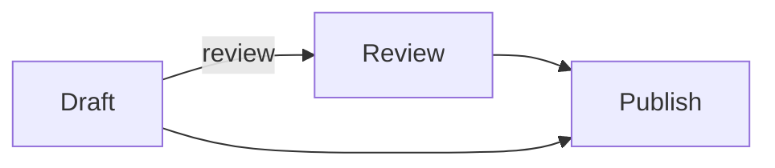

# A small publishing workflow

The same diagram appears twice. Each one points to its own fence in this document.



## Inside a list and a quote

> - This copy has Markdown prefixes that are absent from the Mermaid source.
>
>   ```mermaid
>   flowchart LR
>     A["Draft"] -->|review| B["Review"]
>     B --> C["Publish"]
>     A --> C
>   ```

Ordinary code remains ordinary code:

```js
const meaning = "source ↔ diagram";
```

## Inline text selection

Select **bold text**, *emphasis*, `inline code`, an escaped \*star\*, or an entity: &amp;.
Drag across lines and formatting to select the corresponding original Markdown.
