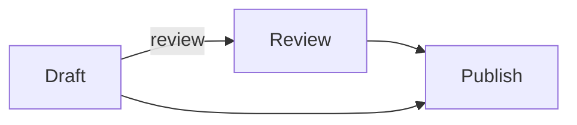
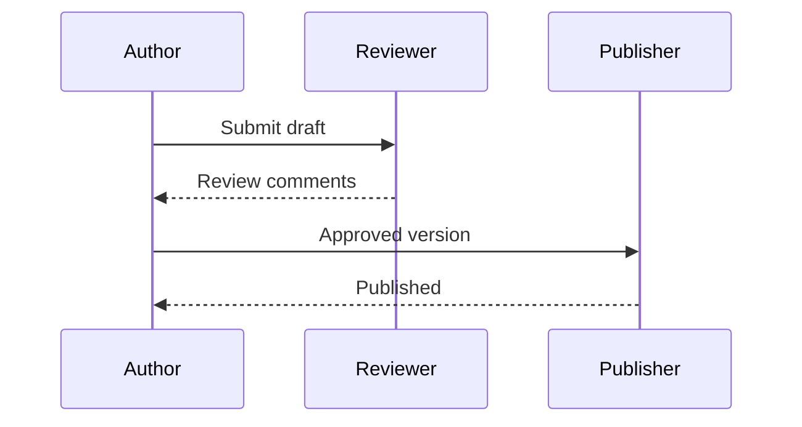

# Publishing workflow

Select a heading or paragraph, drag **a piece of text**, or click a diagram element.

## Sequence diagram

Select participants, connectors or labels to copy their source locations. Clicking the background selects the whole diagram.

