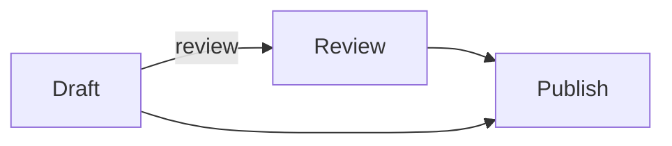
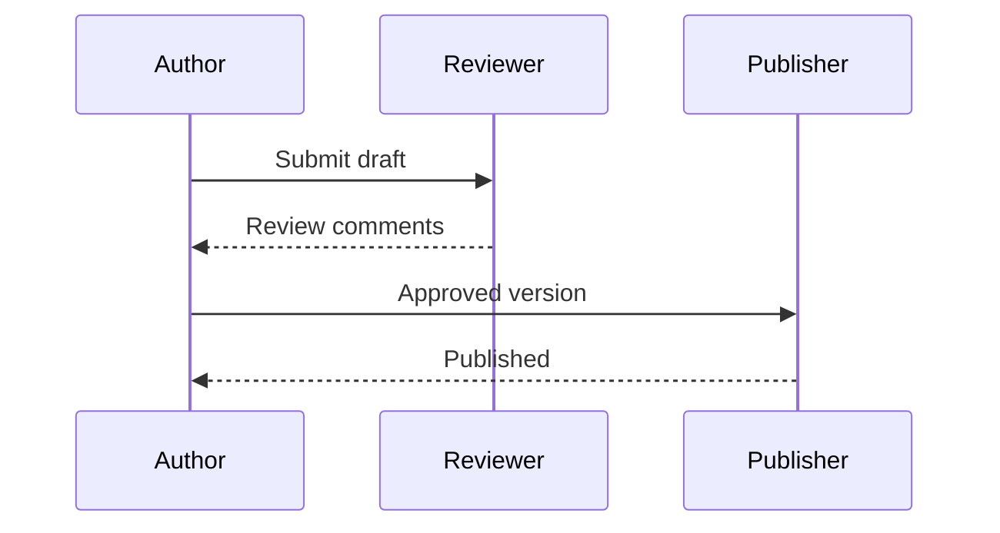

# Publishing workflow

Select a heading or paragraph, drag **a piece of text**, or click a diagram element.

## Sequence diagram

This diagram renders normally. Selection currently identifies its whole fenced block; participant and message locations need source-map support in the Mermaid fork.

