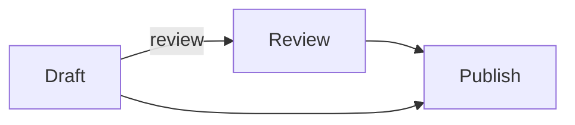
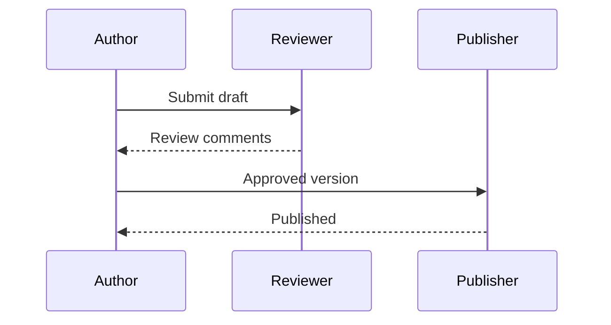
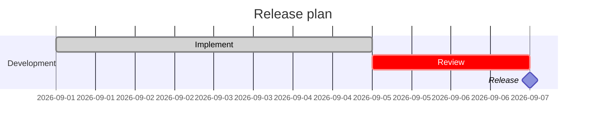
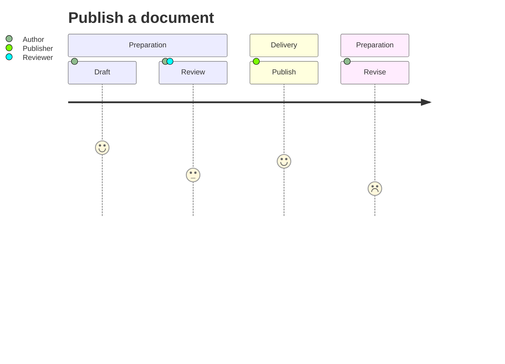
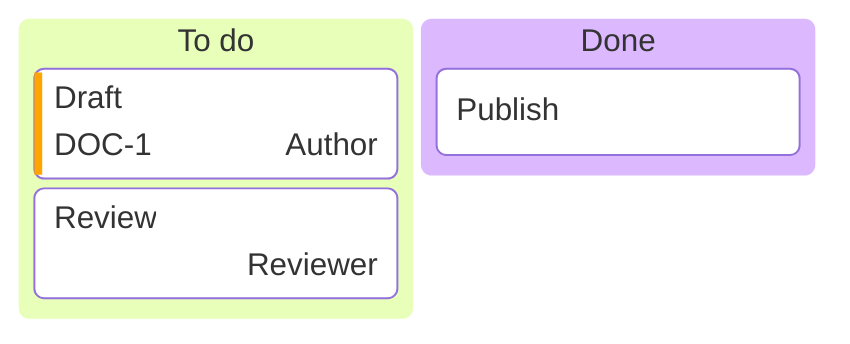
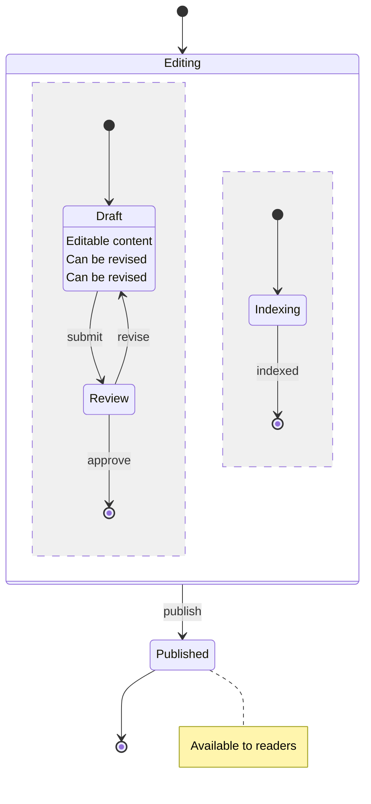

# Publishing workflow

Select a heading or paragraph, drag **a piece of text**, or click a diagram element.

## Sequence diagram

Select participants, connectors or labels to copy their source locations. Clicking the background selects the whole diagram.

## Gantt plan

Select task bars, milestones, labels, the section or title.

## User journey

Select tasks, labels, scores or actor circles and legend entries.

## Kanban board

Select columns, cards, labels, ticket/assignee text or the priority stripe.

## State diagram

Select states, individual description rows, concurrent regions, composite frames, transitions or attached notes.

