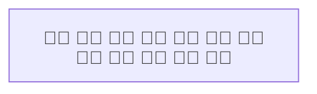

# Prepared emoji fallback

The unfinished font integration uses a bundled OpenType emoji fallback before system fallback fonts. Explicit authored font families still take precedence. Native measurement and SVG export share that database through `NativeFontContext::from_database`; this does not install fonts globally. Preserving existing CSS font-size changes remains mandatory.

Apple Color Emoji uses AAT shaping that Chromium drops from downloaded fonts: a joined emoji can become two glyphs and overflow native-measured geometry. The prepared Noto font retains OpenType shaping and packages the original PNG glyphs as sbix. Repeated combining-cluster and joined-emoji geometry checks now pass in Chromium, Firefox and real Safari; Safari also passes their saved/live source and clipboard checks. These bounded checks do not establish all-font or all-configuration acceptance. Explicitly requested AAT fonts are an unresolved portability case.

## Source and reproduction

- Source: [Noto Emoji revision e20cbc2](https://github.com/googlefonts/noto-emoji/tree/e20cbc2bbec1926686be9f9bee7d1d2cfa1fea0e), `2D/fonts/NotoColorEmoji_WindowsCompatible.ttf`.
- Source SHA-256: `2c7ede2f5438f9c1da098778bd681535933a345334008bb03fc51119f6b1cd72`.
- Prepared asset: [NotoColorEmoji-sbix.ttf](../mermaid-trace-rs/assets/fonts/NotoColorEmoji-sbix.ttf).
- Prepared SHA-256: `100363ed01d0926f912545d123ea3cb3d55a750748f8db0ce476bb1e242c34a9`.
- [SIL Open Font License 1.1](../mermaid-trace-rs/assets/fonts/LICENSE); original copyright and font naming records retained. The modified font remains under that license.

Download the source file at that exact revision. With Python and FontTools **4.60.1**, run from the repository root:

```sh
python3 mermaid-trace-rs/scripts/prepare-emoji-font.py /path/to/NotoColorEmoji_WindowsCompatible.ttf /tmp/NotoColorEmoji-sbix.ttf
cmp /tmp/NotoColorEmoji-sbix.ttf mermaid-trace-rs/assets/fonts/NotoColorEmoji-sbix.ttf
```

The script replaces CBDT/CBLC bitmap storage with sbix, preserving PNG bytes and bearings. It verifies unchanged GSUB shaping, cmap character mappings and hmtx advances, reopens every bitmap, and checks the exact output hash. FontTools is only needed to update this asset; it is not a runtime or normal build dependency. Production export subsets the selected font, rather than attaching the whole fallback to every SVG.

The asset and preparation are committed independently of the unfinished runtime integration. [Font acceptance and remaining gaps](specs/flowchart-mapping/spec.md) govern adoption; the asset alone does not establish portable typography.

## Explicit AAT font: confirmed portability gap

The current native producer fails Chromium containment when `fontFamily` explicitly selects `Apple Color Emoji`. At 16px, twelve joined `🧑‍💻` labels paint 562px wide in a 428px node; twelve `👩🏽‍🚀` labels paint 754px wide. Dagre and ELK reproduce it. CDP confirms the embedded Apple face is actually painted, so this is not an accidental fallback to another font. The working-tree `FONT-PORTABLE/SHAPING` regression fails both explicit-family cases in Chromium and Firefox while its four bundled-fallback cases pass.

Reproduce through the native preview (use `layout: elk` for the second layout):



The prepared subset retains `morx` and lacks `GSUB`. [Chromium's font decoder](https://raw.githubusercontent.com/chromium/chromium/main/third_party/blink/renderer/platform/fonts/web_font_decoder.cc) passes OpenType shaping tables through, while AAT tables receive the sanitizer's default handling. [FontForge documents partial conversion](https://fontforge.org/docs/techref/gposgsub.html#what-features-can-be-interconverted-between-opentype-and-aat), including lost contextual ligatures; it cannot be assumed to supply a lossless general conversion.

No font substitution or new conversion dependency has been adopted. Permission to use an explicit diagnostic plus a portable fallback for unsupported fonts has been requested; absent agreement, the current requirement to preserve authored font choices remains. This is separate from the user-deferred CJK advance discrepancy.
