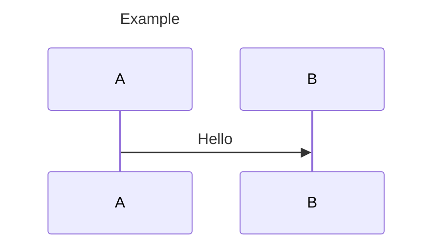
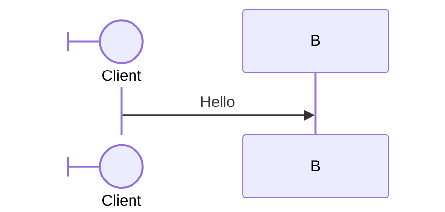
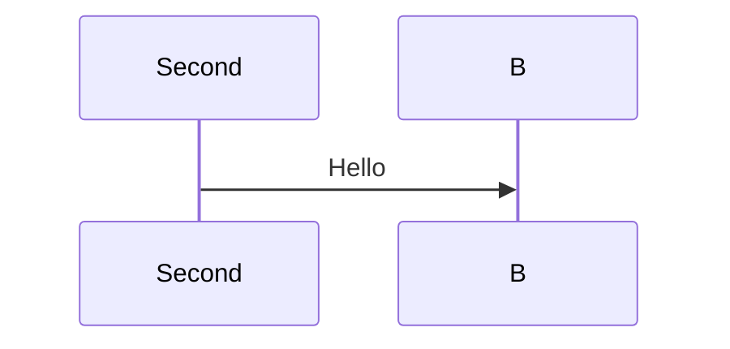
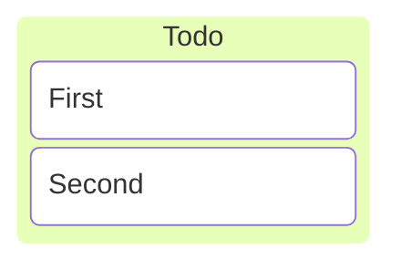

# Existing-family goal: evidence audit

2026-09-28. The baseline below records the read-only audit at the named Trace revision; subsequent authorized fixes are recorded under [implementation checkpoints](#implementation-checkpoints). The user resumed the broader goal on 2026-09-29 with its agreed browser/fidelity boundaries unchanged. Process: [goal reassessment](../../GOAL-REASSESSMENT.md).

## Reference and audit boundary

- **Trace revision:** `767376302e8038914672b39597ac1b0915bb946b`.
- **Product reference:** installed Mermaid **12.0.0**; local Mermaid source/registry revision `f9387456a1e27315e325ada0d8a1cc583ecdf95b`. The six-family interpretation is flowchart (including ELK), sequence, Gantt, journey, Kanban and state. The [37-entry release gate](spec.md) remains separate and unchanged.
- **Native reference:** Merman `72c024776a4bf2dfb9a769b67910736229355906` plus [historical native-provenance.patch](https://github.com/Nek/mermaid-trace/blob/767376302e8038914672b39597ac1b0915bb946b/mermaid-trace-rs/patches/native-provenance.patch), SHA-256 `c3050927499f6dcd6d7eeed2f0440a5ed456487beb7f021da53b32146b258501`. The local vendor symlink resolves to development revision `92faa8be485f5860b08b8981fecbfaed8639e719`; its complete binary diff from the base matches that patch byte for byte, and the checkout is clean.
- **Version mismatch:** Merman's fidelity baseline is Mermaid **11.17.2**, locked to `dcb694ddb58dc5ad3502e7e903cac05fd812eac3`. That baseline source checkout is not available locally. Its fixture corpus is valuable evidence, but cannot establish complete Mermaid 12 compatibility. No downgrade of the product requirement is assumed.
- **Execution boundary:** native Rust process hosted by Node 24.19.0; static SVG plus separate TypeScript activation. Existing 50,000-UTF-16-unit input cap and Merman CLI resource limits apply. Browser probes used Playwright 1.63.0 / Chromium 153.0.8010.12 on macOS arm64 with Noto Sans 5.3.0, not Firefox, Safari or manual acceptance.

One bounded pass inspected the six Mermaid grammar files and corresponding native grammar/parser and renderer/configuration paths, the Mermaid configuration schema, Trace projection, family tests and existing specs. Checks comprised the current full project suite, a native batch over the sequence/Kanban fixtures, and six targeted native-versus-Mermaid-12 render probes. This is a construct-level inventory; a complete option-by-option compatibility crosswalk is still missing. No production code or acceptance tests were changed.

## Coverage and gaps

**Verified** means the named bounded check passed at the revisions above. It does not mean the entire family is complete. **Unverified** means missing evidence, not a demonstrated failure.

| Requirement / construct and variants | Status | Evidence or concrete missing check | Responsible layer / cause |
| --- | --- | --- | --- |
| Flowchart: mapped wrappers and unchanged static rendering across 1,158 pinned fixtures | verified | Native `flow_ac5_full_pinned_inventory_maps_semantic_wrappers_and_preserves_svg` passed; [tests](../../../mermaid-trace-rs/tests/flowchart.rs) | Native provenance and SVG projection |
| Flowchart: 146 shape names, 195 connector forms, label forms, both layouts, three looks and HTML modes | verified | Existing native inventory and saved/live variant tests pass; this covers their declared combinations, not all configurations | Parser, renderer, activation |
| Flowchart: remaining configuration and grammar interactions | unverified | Finish [FLOW-2](../flowchart-mapping/spec.md#flow-2-complete-flowchart-family-coverage)'s crosswalk: spacing/padding/wrapping, curves, direction inheritance, styles/shape data, root/theme precedence and boundary values; distinguish covered cases from remaining combinations | Coverage inventory; no new defect demonstrated here |
| Sequence: basic participants, messages, notes, activation and named control blocks; note-reference ownership | verified | Four [native tests](../../../mermaid-trace-rs/tests/sequence.rs) and two [saved/live tests](../../../mermaid-trace-ts/test/sequence-activation.test.ts) pass | Native mapping and activation |
| Sequence: visible title | confirmed broken | S1 below: SVG contains `Example`, but portable mapping has no title | Native action-to-provenance capture omits the title |
| Sequence: configured participant alias | confirmed broken | S2: visible `Client` label maps to source `A` | Native label capture does not retain the configuration alias value span |
| Sequence: repeated participant declarations | confirmed broken | S3: first declaration is absent from native occurrence metadata and portable map | Native capture overwrites the previous actor occurrence |
| Sequence: all 322 pinned fixtures | unverified | 321 return artifacts; one is rejected by both native and Mermaid 12. Accepted artifacts have valid UTF-16 bounds, but exact owners/labels and static parity were not established by this batch | Missing family-wide mapping assertions |
| Sequence: lifecycle, all arrow forms, autonumber, links/properties/details, wrapping and menus | unverified | Grammar contains create/destroy, half/central/bidirectional arrows, control branches and participant configuration. Need exact-span and saved/live checks for each alternative and its effects; four native tests do not prove this coverage | Native provenance, renderer bindings and acceptance |
| Sequence: spacing, dimensions, fonts/alignment, mirrored/hidden participants, numbering, look and viewport configuration | unverified | Need option-by-option classification and boundary checks against the pinned schema/renderer; current generic configuration provenance is insufficient | Configuration semantics and visual ownership |
| Gantt: 157 pinned fixtures, tasks/milestones, fields/date dependencies, repeated IDs, sections/titles, directives and clicks | verified | Existing corpus and focused [planning tests](../../../mermaid-trace-rs/tests/planning.rs) pass, including mapped/plain parity and saved/live cases | Native mapping and renderer |
| Gantt: complete date/configuration combinations | unverified | Reconcile date/duration/exclusion/weekend/calendar alternatives, compact/top-axis behavior and every rendering option with existing checks. Current font, tick, root and degenerate-geometry tests cover specific boundaries, not the full space | Inventory and differential evidence |
| Journey: 26 pinned fixtures, scores/actors, repeated sections, title precedence, palettes, fonts and geometry boundaries | verified | Nineteen [native tests](../../../mermaid-trace-rs/tests/journey.rs) and declared saved/live cases pass | Native mapping, safe export and activation |
| Journey: complete pinned syntax/configuration contract | unverified | Crosswalk all schema options to implemented effects or proven upstream no-ops; verify remaining interactions and Mermaid 12 differences | Evidence gap; no new failure found |
| Kanban: distinct columns/cards, labels, ticket/assigned/priority fields | verified | Existing native and saved/live PLAN-AC2/3 cases pass | Native mapping and activation |
| Kanban: repeated authored IDs | confirmed broken | K1: valid input is rejected. Seven of 87 pinned fixtures fail with the same projection error | Native keys conflate occurrence identity with authored ID; shared projection rejects multiple labels |
| Kanban: full 87-fixture inventory, unlabeled/generated IDs, shape/Markdown labels, metadata overrides, icons/classes and malformed-input recovery | unverified | 80 return artifacts with valid UTF-16 bounds. Need independent owner/label expectations, mapped/plain parity and browser acceptance; basic PLAN-AC2/3 is not this gate | Native capture/binding and missing coverage |
| Kanban: section width, padding, ticket URL, font/look and viewport precedence | unverified | Need effect/no-op classification, URL safety and boundary checks, including native `mindmap`/`kanban` precedence | Renderer/configuration and host activation |
| State: 286 pinned fixtures and 48 header/direction/look/HTML variants; notes, regions, transitions and repeated-description ownership | verified | Eighteen [native tests](../../../mermaid-trace-rs/tests/structural.rs), STATE-2 and declared saved/live checks pass | Existing state gate remains valid |
| State: Mermaid 12 differences and complete configuration crosswalk | unverified | STATE-2's pinned inventory is not evidence for every newer syntax/configuration combination. Check schema options and renderer aliases against the product reference | Version/coverage evidence; no new state defect found |
| Shared source ownership and equal-span grouping | verified | Existing state-note/region, flowchart, journey and sequence-note saved/live checks pass; [contract](../source-ownership/spec.md) unchanged | Shared activation works for the checked mappings |
| Every native occurrence either binds a visual or has an explicit nonvisual/generated disposition | unverified | Batch flagged unbound occurrences in 62 sequence and eight successful Kanban fixtures. Activation-end/control markers and column-only metadata can be legitimately nonvisual; classify them before declaring bugs | Native classification/projection; counts are triage, not defect counts |
| Configuration provenance for all six families, saved artifact validation, instance isolation and CLI watch/source pane | verified | Current [source-provenance](../../../mermaid-trace-ts/test/source-provenance.test.ts), [activation](../../../mermaid-trace-ts/test/svg-activation.test.ts) and [CLI](../../../mermaid-trace-ts/test/watch-cli.test.ts) suites pass within their assertions | Shared metadata/Markdown/activation |
| Retired-demo migration acceptance on current route | unverified | Real rendered-text drag/formatted ranges, scripts-disabled rendering and denied-clipboard behavior need current native-preview acceptance; see [activation verification](../svg-activation/spec.md) | Missing host/browser evidence; do not silently retire behavior |
| Full six-family compatibility with Mermaid 12 and broader browser support | unverified | No complete 11.17.2→12 grammar/configuration diff or cross-browser acceptance was run | Reference and environment boundary |

## Confirmed defect reproducers

Feed these sources to the existing native JSON-lines executable as `{"id":"audit","source":"…"}`. Compare reference rendering through `renderReferences` in [mermaid-browser.ts](../../../mermaid-trace-ts/src/producer/mermaid-browser.ts). All four inputs render in the installed Mermaid 12 reference harness. These are distinct demonstrated failures; no claim is made that one fix closes them all.

**S1 — title has no source-backed target:** expected title mapping for the displayed `Example`.

**S2 — configuration alias has the wrong label range:** both renderers display `Client`; native actor `A` has `labelSpan` `[28,29)`, selecting `A`. Expected the authored `Client` value, with the rest of the declaration owned by the participant.

**S3 — earlier declaration is erased:** both renderers display `Second`, correctly. Native `sequence/parse.rs::build_sequence_db` replaces the previous `actor:A` occurrence. Expected both declarations retained, with explicit effective/superseded ownership; the first must not invent a displayed `First` label or disappear from provenance.

**K1 — repeated ID breaks artifact production:** reference displays two cards; native returns `Unsupported source map: multiple explicit labels for one node`. Expected separate card occurrences, visual identities and source ranges. Do not fix this by accepting two distinct cards as one selection target.

The native parser constructs keys from `node.id` in `kanban.rs`; Trace's shared `annotate` guard then encounters multiple labels for that key. The pinned fixture `upstream_cypress_kanban_spec_1_should_render_a_kanban_with_a_single_section_001.mmd` reproduces the same failure. Six other upstream-derived fixtures trigger that guard; they are not six additional proven root causes.

Two negative findings prevent false bug counts: `sequence/stress_end_keyword_016.mmd` is rejected by both renderers at the `(end)` message target; the Kanban YAML-title probe displays no `Board` title in either renderer, so absence of a visible title binding is not itself a defect.

## Finite completion contract

Browser and visual-fidelity boundaries agreed 2026-09-29; the six-family feature scope is unchanged:

1. Keep the **same six families**, all their pinned Mermaid 12 syntax and applicable configuration/renderer variants, including flowchart ELK. Merman 11.17.2 remains a differential aid, not a reduced compatibility target. Later upstream releases do not expand this goal automatically.
2. Close the four confirmed defects and resolve each unverified row into executable acceptance or source-backed proof of a nonvisual/generated/no-op case. Enumerate grammar alternatives and schema options; exercise boundary classes and interactions that share renderer paths. A fixture count or smoke pass cannot substitute for this crosswalk.
3. Preserve all existing acceptance. Each distinct source-backed visual has exact original UTF-16 ownership; references do not hijack declarations; multiple occurrences survive; equal-span visuals form one logical selection/focus group. Verify source→visual and visual→source, labels, unlabeled connectors, background selection and copied Markdown locations.
4. Verify mapped/plain rendering parity, inert saved SVG activation without the producer, nested/repeated Markdown instances, optional native source selection, CLI reload/error recovery and the outstanding migration checks. Retain the existing safe-export/resource constraints. Newly discovered bugs inside this behavior stay in scope.
5. Keep other families, WASM, packaging/VS Code and the all-family release outside this goal; they remain separate requirements. Require interaction acceptance in Chromium, Safari and Firefox. Accept Merman's visual interpretation: correct content, relationships, readability, required features and exact source mapping are mandatory; matching official Mermaid pixels, spacing or routing is not. Native mapped/plain parity remains required. Current Chromium-only evidence does not establish acceptance in the other two browsers.

## Flowchart configuration crosswalk (resumed work)

Reference remains Mermaid `f9387456a1e27315e325ada0d8a1cc583ecdf95b`, schema `FlowchartDiagramConfig` plus `BaseDiagramConfig`: all 17 distinct keys are enumerated below. This table narrows the earlier unverified configuration row into checks; it does not replace the grammar inventory or establish complete shared/root configuration coverage. Current minimum-width fix: native fork `e3abfb57dedda6eb2923ad096f6a0380002afad5`; all 115 Trace Rust tests pass, including the 1,158-fixture flowchart gate and existing state corpus. The minimum-width saved/live Chromium test passes its 12 variants; seven existing state browser checks also pass. The final focused run passes 25 flowchart/state browser tests (198.5 seconds), plus TypeScript compilation and the fork-bootstrap regression. Native paths are relative to `crates/merman-render/src/` in the pinned fork. Accepted native defaults/layout remain valid; authored options must retain their documented effects.

| Options | Status | Evidence / next check | Layer |
| --- | --- | --- | --- |
| `minNodeWidth` | verified for the declared native/Chromium cases | New `flow_ac5_min_node_width_*` tests check minimum plus existing shape padding, larger minimums, long/empty labels, zero/negative values, absent defaults, icon/image exceptions, unaffected groups/edges, both layouts/HTML modes, exact CRLF/UTF-16 spans and mapped/plain parity. Saved/live acceptance uses all three looks. Safari/Firefox remain required. | Shared node metrics before Dagre/ELK layout; carried into SVG |
| `nodeSpacing`, `rankSpacing` | verified for declared native cases | `flow_ac5_spacing_padding_and_wrapping_preserve_geometry_and_ownership` passes four directions, flat/nested explicitly directed groups and both HTML modes: positive Dagre separation increases on its intended axis; numeric zero retains the native fallback. ELK intentionally ignores these options, matching pinned Mermaid `rendering-util/layout-algorithms/elk/render.ts` root/group spacing rules; identical static output is asserted. Independent ELK configuration remains open. | Layout |
| `padding`, `wrappingWidth` | verified for declared native/Chromium cases | Fork `47130c06a54bfa999649214b39d11309c24da188` shares existing padding/wrap normalization between layout and drawing. The zero-width regression previously sized a one-line box but drew a many-line label. Boundary equivalence covers zero/negative wrapping, negative padding, both layouts/HTML modes and three looks. Positive geometry checks cover four directions, nested groups, narrow/wide Markdown, minimum width, exact Unicode/CRLF ownership, fixed edge wrapping and preserved group-title content (group line breaks may follow native frame geometry). Broader shared Markdown/font settings remain open. | Shared config normalization before layout and drawing |
| `titleTopMargin`, `subGraphTitleMargin` (`top`, `bottom`), `diagramPadding` | verified for declared native/Chromium cases | Fork `226ac70d0861bad58f29c3940f9db3394281d3e0` fixes ELK title margins moving text without reserving space. Group-label layout bounds include both margins; exported label metrics exclude them. `flow_ac5_elk_group_title_margins_*` covers nested/empty groups, external edges and separate/combined margins. `flow_ac5_viewport_*` asserts exact padding expansion, title offset, CRLF/Unicode title ownership and mapped/plain parity. Saved/live containment and interaction cover both layouts, three looks, HTML modes and fixed/responsive roots. Dagre empty/collapsed proxies retain native centered-node treatment. | ELK group-label reservation, layout and viewport |
| `curve`: `bumpX`, `bumpY` | verified for the declared cases | `bumpX` basis fallback fixed in fork `02a27e7aa34e7da234d5a82e3d64656424deece8`. Native dispatch test asserts exact tangents/bounds, empty and single-point paths; Trace regression checks distinct geometry, edge-override precedence, exact ownership and static parity. All 39 flowchart integration tests and 1,272 native renderer unit tests pass. Saved/live Chromium acceptance passes 24 layout/look/HTML/override variants; ELK retains native rounded routing. | Shared native curve dispatch and path/bounds calculation |
| Other `curve` values: `basis`, `cardinal`, `catmullRom`, `linear`, `monotoneX`, `monotoneY`, `natural`, `step`, `stepAfter`, `stepBefore`, `rounded` | verified for declared native/Chromium cases | Fork `83810e1becdebfbc0b45df3c9a46049a9bdadd8c` adds independent D3 3.2.0 dispatch expectations, finite bounds and empty/single-point checks; existing rounded-corner/tangent tests remain green. Merman step paths keep extra collinear input vertices with equivalent geometry. `flow_ac5_all_curves_*` checks all 13 curves across layouts/looks/HTML (156 combinations): omitted/default/edge-override equivalence, self-loops, group endpoints, cross-boundary routes, exact Unicode ownership, visible label bindings and mapped/plain parity. ELK keeps rounded routing. Saved/live Chromium acceptance covers all 13 curves in both layouts, including reverse selection from curve properties. | Native curve dispatch and edge geometry |
| `inheritDir` | verified for declared native/Chromium cases | `flow_ac5_inherited_directions_*` passes 120 combinations of layouts, TB/TD/BT/LR/RL, HTML modes, external leaf connections and implicit/explicit nested scopes. Inherited output matches explicit global-direction declarations; a parent’s scoped direction does not replace the global inheritance source. Last scoped direction wins, false matches absent, and inherited directions invent no source ranges. Twenty saved/live variants verify explicit-direction reverse selection targets its group and inherited groups retain normal frame/title ownership. | Semantic/layout direction |
| `htmlLabels` | verified for declared native/Chromium precedence cases | `flow_ac5_html_label_precedence_*` passes 44 source/site/layout/frontmatter/directive combinations. Root booleans win over deprecated scoped values; null source updates retain the existing setting. Without a root value, native nodes default to HTML while edges/group titles consult the scoped fallback, matching pinned node `labelHelper` versus `getEffectiveHtmlLabels`. Actual exported label modes, exact CRLF/UTF-16 payload ranges and plain/mapped parity are asserted. Twenty saved/live production variants cover conflicts, nulls, nested groups and external connections; mixed fallback output is covered through the Rust embedding API. | Config resolution and labels |
| `useMaxWidth`, `useWidth` | verified for declared native/Chromium cases | `flow_ac5_viewport_*` checks numeric fixed dimensions against the viewBox and responsive width/max-width output, with identical mapped/plain rendering. `useWidth` is a no-op in the pinned flowchart path: `flowRenderer-v3-unified.ts` calls `setupViewPortForSVG` using padding and `useMaxWidth`, without consuming it; a positive authored value retains byte-identical static output. Saved/live selection passes both sizing modes. | Viewport |
| `theme`, `look`, `layout` | verified for scoped resolution; broader theme/layout interactions remain unverified | Fork `e47d21087300eb3514348f5d39c8b238396bb6a2` fixes ignored namespaces before theme generation. Native tests cover source/site precedence, invalid scoped fallback, secure keys, theme variables and isolation across six families. Trace static equivalence covers all 12 pinned theme names/sentinel, frontmatter/directives and three flowchart headers; 24 scoped saved/live Chromium variants pass. Native defaults and forced ELK headers are preserved. | Shared filtered configuration resolution |
| `arrowMarkerAbsolute` | verified for declared Chromium portability cases; Safari/Firefox unverified | Pinned `flowDiagram.ts` copies root to scoped config; `rendering-elements/edges.js` prefixes the browser page URL when enabled. Native export retains local references because it has no host page URL. `FLOW AC5/6: portable markers` passes both values, Dagre/ELK and three looks: arrow/circle/cross markers resolve inside the artifact and render identically with no base, a local base and an external base (36 base contexts). Removing each marker kind independently changes the pixels. Four saved/live variants retain connector/label pointer, keyboard, reverse-source and clipboard behavior. This is evidence of portability in Chromium, not a universal no-op classification or Safari/Firefox workaround. | Marker URL/export and host browser |

Scoped-resolution verification: all **117 Trace Rust tests**, the full native core suite (**1,563 unit tests**, integration tests and doctests), ten focused Chromium tests (including the 24 scoped variants and existing-family acceptance), TypeScript build and bootstrap checks pass. The goal remains incomplete; Safari/Firefox acceptance is still open.

Spacing/wrapping verification (2026-10-04): **119 Trace Rust tests**, **1,272 native renderer unit tests**, the clean pinned native build and eight focused Chromium tests pass. The new saved/live test covers 24 layout/look/HTML/wrap variants with node, group, connector and label pointer/keyboard/reverse-source selection and clipboard checks. Existing group and Gantt/journey/Kanban/state acceptance also passes. The pointer helper now clicks the exact hit-tested screen coordinates, avoiding transformed hand-drawn SVG group offsets. Safari/Firefox acceptance and the broader inventory remain open.

Margin/viewport verification (2026-10-04): **121 Trace Rust tests**, **1,272 native renderer unit tests** and all **24 Chromium margin/sizing variants** pass. Browser assertions check actual title containment and ELK child clearance as well as saved/live pointer, keyboard, reverse-source and clipboard behavior. Full-family and Safari/Firefox acceptance remain incomplete.

Curve verification (2026-10-04): the 156-combination Trace regression, five native curve-dispatch tests and 26 saved/live Chromium curve variants pass. No runtime renderer change was needed. Pointer acceptance now samples exposed stroke near connector endpoints too, because a label can cover all four former interior sample points. Existing state-note and bump connector checks also pass after that shared test-helper change. The clean pinned build, TypeScript build and fork-bootstrap regression pass. This closes the declared curve option checks, not full-family or Safari/Firefox acceptance.

Direction/HTML verification (2026-10-04): both new Rust regressions pass (120 direction combinations and 44 label-precedence combinations), as do 20 saved/live Chromium variants and the TypeScript build. Existing runtime behavior already satisfies these cases; only tests and documentation changed. This does not establish the remaining shared configuration/grammar or Safari/Firefox gates.

## Shared/root configuration crosswalk

The same pinned schema has **27 shared/root keys** after excluding diagram namespaces; all are listed here, including all **12 `elk` children**. This inventories names, not complete behavior: `themeVariables`, CSS, DOMPurify settings and remaining grammar alternatives still require their own bounded cases. Renderer defaults/visual interpretation remain native. No new family or acceptance requirement is introduced.

| Options | Status / next check | Responsible layer / reference |
| --- | --- | --- |
| `theme`, `look`, `layout`, `htmlLabels` | Verified only for the scoped-resolution and label-precedence cases above; broader rendering interactions unverified. | Shared configuration, native renderer |
| `themeVariables`, `darkMode` | Unverified inventory: enumerate applicable flowchart/theme properties and their emitted colors, dimensions and precedence. Existing radius/scoped-theme cases are partial evidence. | Native theme derivation and geometry; pinned `themes/` |
| `themeCSS` | Unverified: site/source secure filtering, scoped CSS, actual safe-export appearance and diagram isolation. Do not allow source CSS to bypass the host security policy. | Core config/preprocessing and safe SVG cascade; pinned `mermaidAPI.ts` |
| `fontFamily`, `altFontFamily`, `fontSize` | **Confirmed broken containment case**, broader inventory unverified: under default typography a Neo node with the Markdown label `Alpha **bold** beta gamma delta epsilon 😀` and disabled auto-wrap has a 288px shape but about 294px of visible SVG text in Chromium, in both Dagre and ELK. Native default text measurement uses character-width estimates (`text/heuristic.rs`), not font glyph metrics; classic/hand-drawn padding masks this case. Keep the failing browser assertion and repair the measurement boundary rather than increasing arbitrary padding or relaxing containment. Theme/root precedence, fallback and zero/positive sizing remain open. `altFontFamily` is emitted as a CSS variable by pinned `createCssStyles`; the schema's “unused” comment alone does not establish a no-op. | Native text metrics/cascade; pinned `mermaidAPI.ts`, label helpers |
| `markdownAutoWrap`, `wrap` | **Fix in progress, not complete:** disabled auto-wrap was ignored for SVG labels and measured wrapped dimensions for unwrapped HTML labels. A shared native wrap decision now reaches node/group measurements and both edge-layout paths plus drawing; native regressions and the 125-test Trace Rust suite pass, including exact Unicode/CRLF ranges, plain/mapped equality and unchanged plain-label/root-`wrap` behavior. The 12 saved/live selection subtests now pass independently; 10 of 12 geometry subtests pass, with the two Neo/SVG-label variants failing strict shape containment. The parent test remains failing; no full browser acceptance is claimed. Root `wrap` is consumed by pinned `sequenceDb.ts` through `setWrap`/`autoWrap`; flowchart invariance is verified, sequence coverage is not implied. | Native label measurement/drawing; pinned label helpers and family config |
| `handDrawnSeed` | Verified native artifact behavior for omitted, zero, 42 and 43 across both layouts/all looks (24 variants): repeated output, exact owned ranges and mapped/plain parity; distinct nonzero seeds change rough geometry only. No runtime fix needed. Seed-specific browser acceptance remains unverified. | Native rough drawing and render environment |
| `arrowMarkerAbsolute` | Chromium artifact portability verified above; Safari/Firefox still unverified. No native host URL is available to serialize. | Static export / HTML host |
| `deterministicIds`, `deterministicIDSeed` | Browser auto-discovery controls in pinned `mermaid.ts` (`InitIDGenerator`). Trace supplies the SVG ID explicitly and defaults to deterministic export. Source/site overrides, repeated artifacts and ID/reference isolation still need focused acceptance. | Producer ID and SVG export; not DOM auto-discovery |
| `maxTextSize`, `maxEdges` | Unverified configuration/boundary crosswalk. Trace has a fixed 50,000 UTF-16-unit admission cap and native CLI resource policy; test interaction with lower site limits, secure source overrides and actionable errors. Existing caps are not evidence that all authored limits work. | Trace admission, native resource policy/config |
| `securityLevel`, `secure`, `dompurifyConfig` | Secure filtering has shared native tests; full rendering/link/sanitizer cases remain unverified. Inventory permitted inert markup/URLs and host restrictions; callback execution and browser sandbox creation are not part of the static producer. Opaque DOMPurify config needs a supported-option crosswalk before completion. | Native sanitization/safe export and host activation |
| `legacyMathML`, `forceLegacyMathML` | Browser KaTeX/MathML fallback controls; Trace uses native RaTeX geometry. Existing formula-visibility tests verify native output, but option invariance and combined text/math cases remain unverified. | Native math conversion; pinned browser math fallback |
| `logLevel`, `startOnLoad`, `suppressErrorRendering` | Pinned Mermaid logging/DOM lifecycle controls, not diagram geometry. Trace renders explicitly, returns errors and preserves the last good watch document. Verify these values cannot introduce scripts, error graphics or rendering side effects; no Mermaid DOM auto-start loop is required by the existing component boundary. | Integration/API; pinned `mermaid.ts`, `mermaidAPI.ts` |
| `elk.mergeEdges`, `elk.nodePlacementStrategy`, `elk.nodePlacementAlignment`, `elk.cycleBreakingStrategy`, `elk.forceNodeModelOrder`, `elk.considerModelOrder`, `elk.keepEntryNodeOnTop` | Native readers and adapter tests exist; end-to-end geometry, combinations, cycle/container cases and exact-selection acceptance remain unverified. Reader presence alone is not a pass. | Native `flowchart/elk.rs`; pinned `rendering-util/layout-algorithms/elk/render.ts` |
| `elk.preset`, `elk.straightenEdges`, `elk.lineHops`, `elk.layeringStrategy`, `elk.layeringLayerBound` | Unverified, with a concrete implementation concern: no readers found in the native flowchart ELK path at fork `83810e1b`. Probe authored effects independently against the pinned ELK renderer before defining minimal fixes. Retain Merman's default interpretation; silently ignoring meaningful explicit options would not satisfy coverage. | ELK layout/routing and SVG geometry |

Marker verification uses native fork `83810e1b`, TypeScript build and one focused Chromium acceptance test (12 render variants, 36 base contexts, four saved/live variants), all passing. The current Firefox run also passes the same 12 render variants, 36 base contexts and four saved/live variants, including pixel changes when each marker kind is removed (18.7 seconds). This uses the unfinished font integration. Real Safari marker portability remains unverified.

Current unfinished slice: finish font-accurate sizing and portable embedded-font integration under the [existing requirement and plan](../flowchart-mapping/spec.md). The current full Trace Rust suite passes **130 tests**: 48 flowchart, five font contracts, 19 journey, 32 planning, seven sequence, one shared-provenance and 18 state tests. This includes the 1,158-fixture flowchart inventory, mapped/plain parity, exact source ownership and measured missing-character replacements. Evidence uses native pin `859a3956` plus uncommitted Merman/Trace font and wrapping changes and the local usvg override at `cf6e6b6`; it does not establish clean-pin reproduction. The temporary test override has been removed from Trace's lockfile.

The working-tree integration also passes the 25 disabled-wrapping Chromium checks, including both former Neo containment failures, and the browser acceptance recorded below. Font-size edits remain mandatory; do not return to fixed glyph output that breaks them. Reproducible dependency publication, explicit AAT-font shaping and broader typography/configuration acceptance remain open. The running preview is unchanged. No guessed padding or weakened containment tolerances are permitted. ELK option effects, shared configuration rows and remaining grammar coverage still apply; the only deferred typography issue is [FONT-CJK-ADVANCE](../../ROADMAP.md#deferred-known-bugs).

### Browser and migration blockers (2026-10-05)

The four existing sequence saved/live interaction tests pass against native `47028a35` and the working-tree font integration. Chromium evidence does not establish the other browser gates.

- Firefox startup is resolved for tests: the same pinned Firefox 155.0 runtime (revision 1543) launches with isolated application branding after its ordinary launch failed with `Could not find profile folder`. The [shared test launcher](../../../mermaid-trace-ts/test/browser.ts) follows the isolation identified in [Playwright #42768](https://github.com/microsoft/playwright/issues/42768), retaining the browser bundle, user profile and OS permissions. All seven saved-SVG activation tests and four native sequence saved/live tests pass, including real clipboard reads/writes, pointer/keyboard and reverse-source selection. Firefox's test clipboard preference supplies permission without mocking the API. The nine existing watch/CLI tests also pass in Firefox and Chromium after fixing deletion of Firefox’s collapsed text-drag anchor. This verifies native rendered-text drag, source-pane and rendered-text Copy, exact locations, saves/recovery, sizing, assets and shutdown. The later publication-only warning fix passes all 11 working-tree watch tests in both browsers, including missing-character diagnostics on startup and unchanged saves; the font integration itself remains unfinished. These native checks use the unfinished font integration; they do not establish clean-pin font portability, every family/configuration or Safari acceptance. See the [reproducible command](../../../README.md).
- Safari 27.0 (22625.1.29.11.27) passes **27 saved and 27 live cases** through its native MCP interface in [Safari acceptance](../../../mermaid-trace-ts/test/safari-activation.test.ts), using the working-tree font integration. Coverage includes labels and bodies across six families plus ELK, formula labels, repeated combining/emoji labels with horizontal/vertical containment, connectors, repeated actors and coherent state note/attachment groups. Trusted click/Enter/Space events preserve exact source ranges, all group highlights, one keyboard stop, focus appearance, instance isolation and saved disposal. The real watch preview checks native source scrolling and actual macOS clipboard writes; focus and reverse-source selection do not copy. The watcher check additionally passes ordinary/unchanged saves, invalid-edit retention and atomic replacement without manual navigation, verifying current CRLF/Unicode source and copied locations for all seven diagrams. The 281-second run reports 56 passing tests including the parent. This is real Safari, not Playwright WebKit; only test-owned tabs/servers are closed. Full configuration/typography, native source-pointer selection and ordinary Copy acceptance remain incomplete. WebDriver session creation still times out; the native driver provides the verified route.
- The existing Gantt CSS font-size reveal regression is confirmed failing under glyph output. The existing migration contract resolves the [typography correction](../../GOAL-REASSESSMENT.md): preserve CSS font-size edits. Do not dismiss this as a selector-only test adaptation or weaken its expected result.

The next bounded Firefox native-interaction matrix passed 20 of 28 tests initially. Eight failures traced to test pointer coordinates: fractional hit-test points became integer browser events, or fixed edge offsets missed rounded/rough bodies. Reusing exposed integer-pixel targeting preserves all selection and clipboard assertions; the three label/actor regressions and five body/region/note regressions now pass in focused reruns. Eight affected Chromium regression tests and the TypeScript build also pass. Coverage includes flowchart/ELK reference ownership and source forms, state regions/notes, Gantt dependencies and font reveal, journey actor/section ownership and Kanban selection. Native tests can now use the same browser selector; the dedicated CDP font-face inspection remains explicitly Chromium-only. This is bounded interaction evidence against the unfinished font integration, not complete Firefox typography/configuration or six-family acceptance.

The remaining Firefox matrix reports 70 passing checks, four failures and one timeout. Focused reruns resolve all four failures: exact integer connector targeting, NBSP-preserving selected-range assertions, the existing hit rectangle for nested formula labels, and the shared activator's false clipping of visible nested SVGs. Fourteen focused Firefox checks pass, followed by both corrected formula/nested-viewport checks; all 15 corresponding Chromium checks pass. Real Safari passes nine saved native-label cases including both formula layouts. Journey's 72-case geometry matrix passes unchanged assertions in 190.2 seconds when given a longer deadline; its former 180-second aggregate limit was too short. The test now allows 300 seconds, without removing cases or changing render/interaction limits. A subsequent Firefox run passes all 28 reported checks for wrapping boundaries, title margins/viewport sizing, inherited directions/HTML precedence and disabled Markdown wrapping, including measured containment and saved/live source/clipboard behavior (270.8 seconds). The mixed-font structural CSS/size-edit check also passes in Firefox and real Safari. These checks use the unfinished font integration and local usvg override; clean-pin reproduction and full typography/configuration acceptance remain incomplete.

Missing-character acceptance now includes Firefox and real Safari across all six families plus ELK. Safari passes seven saved and seven live cases (94 seconds), checking two drawn replacement symbols while original Unicode source ranges, trusted pointer/Enter/Space, scrolling, clipboard, reverse selection, isolation and disposal remain exact. Wrapped SVG rows omit separator spaces in concatenated `textContent`; the test checks replacement symbols there and preserves exact authored-text assertions in the source view. Firefox passes the same saved/live replacement ownership checks through the shared browser launcher; the Chromium rerun also passes unchanged pixels with local fonts disabled and verifies every painted font is embedded. Those font-inspection checks remain explicitly Chromium-only. These tests are part of the unfinished font integration. Adding the Safari cases raises its aggregate deadline from 360 to 480 seconds; per-request limits and assertions are unchanged. Vite reports HTML noncharacter warnings for these deliberately undrawable code points, while the rendered pages and original-source selections pass.

### Font backend admission probe (2026-10-04)

The installed usvg 0.47 native shaping path is a candidate, not an adopted backend. Its font resolver counterparts already exist in `merman-export/src/lib.rs` (`shared_system_fontdb`, case-insensitive selection and generic family setup); do not duplicate them. A bounded local comparison used identical 16px Trebuchet MS SVG text in native usvg and Chromium. The browser confirmed the TrebuchetMS face. Explicit `xml:space="preserve"` removed a 4.82px discrepancy at a bold span boundary; silently losing whitespace is not an acceptable sizing fix.

| Text case | Native width × height (px) | Chromium bbox (px) |
| --- | --- | --- |
| Plain Latin | 231.133 × 18.578 | 231.141 × 19 |
| Bold run | 268.320 × 18.578 | 268.328 × 19 |
| Italic `AV fj` | 34.313 × 18.578 | 34.563 × 19 |
| Combining marks | 22.984 × 18.578 | 22.984 × 19 |
| Latin + CJK fallback | 102.258 × 21.438 | 102.688 × 19 |
| Latin + emoji | 61.039 × 21 | 66.039 × 22 |
| Full failing mixed label | 289.141 × 21 | 294.164 × 22 |

This rules out treating an unmodified usvg bbox as interchangeable with browser text bounds. Advances alone also miss italic overhang. A native self-contained glyph export is technically available: the mixed-label probe produced six paths plus one embedded color-emoji image with no remaining text element (about 52 KB). However, whole-document serialization retained the probe's SVG ID and **discarded its source mapping attributes**. It is not an acceptable drop-in export path. Before adopting native glyph output, verify source-preserving replacement at the existing label boundary, accessible authored text, color glyphs, artifact size and saved/live selection; compare that approach with retaining text and resolved font assets. Neither path is admitted as the production backend yet. The current two failing Neo regressions and all other coverage gates remain required.

A source-preserving label-only prototype now passes the saved-artifact `FONT-PORTABLE` acceptance test in `svg-activation.test.ts`: real pointer, Enter/Space, exact source range and formatted clipboard location, reverse selection, instance isolation and byte-for-byte disposal restoration. Changing the host font family and size leaves glyph pixels unchanged. The artifact contains native usvg glyph paths and an embedded color-emoji image inside the original mapped label group, with the original source metadata retained. The test first failed when ordinary node path CSS recolored the glyphs; preserving resolved text fill/stroke makes it pass. All three tests in that activation file and the TypeScript build pass. This is a prototype fixture, not output from a new production renderer; live producer integration, nested independently mapped text spans, broader paint/configuration, font measurement and Safari/Firefox remain unverified.

Native fork `9198ac5fe7bd53d1ac11210bd502bfc8e033c475` fixes the shared SVG styled-height propagation regression. `styled_labels_preserve_host_measured_vertical_metrics` first failed because Markdown/HTML formatted SVG rows lost provider-supplied bold/italic heights. The fix unions styled run bounds at their emitted baselines, including mixed styles and wrapped/multiline rows. The initial test incorrectly treated HTML's authored 1.5em line box as glyph bounds; that expectation was corrected, as was consecutive Markdown break normalization to match both pinned parsers. HTML glyph-ink containment remains a separate open check.

Verification: all **1,275 native renderer unit tests**, **125 Trace Rust tests** and two focused saved/live Chromium multiline/wrapping selection tests pass against the rebuilt binary. These runs include the still-uncommitted wrapping changes; clean-pin reproduction is not claimed. Existing callback-order tests remain green. This change preserves supplied SVG heights; it does not provide a real font backend, establish final baseline placement or opaque wrapping-plan bounds, fix the two Neo width failures, or complete portable six-family font acceptance.

Native shaping/measurement component: [fork `91698b76`](https://github.com/Nek/merman/blob/91698b7672f7e2fd16cda9c56901ac6ab001bec4/crates/merman-export/src/text/measurement.rs) supplies optional `NativeFontContext` and its operation-aware measurement policy. Actual font assets drive logical/ink bounds and portable glyph output; resolved face names expose fallback. The existing wrapper now retains its line plan for measured vertical bounds, and formatted baseline offsets are verified against emitted SVG. Native tests cover styles, combining marks, Arabic, CJK/emoji fallback, escaping, whitespace, zero-width text, missing fonts/glyphs, scaling and reopened glyph bounds. **1,276 renderer unit tests**, **64 export tests** and **127 Trace Rust tests** pass. New diagram checks prove font-width deltas reach Dagre/ELK node geometry in both HTML modes; declared six-family examples use host measurements without approximate fallback and preserve mapped/plain parity. Tests run with the existing uncommitted wrapping changes; clean-pin reproduction is not claimed. Six earlier native-produced glyph artifacts pass Chromium containment and identical-pixel checks under host font changes. These checks do not establish complete fonts/configuration, source-preserving glyph integration or Safari/Firefox acceptance. Trace enables the font component only as a test dependency so far. The [glyph-emission checks](../flowchart-mapping/spec.md) now pair measured layout with outlined samples across all six families and preserve native/portable source identities. Production still must install the pair, reject fallback provenance and validate the broader font/configuration/browser gates; the two Neo width failures remain required.

## Measurements and next decision

`make test typecheck` passed with Node 24.19.0: **107 Rust tests, 98 TypeScript/browser tests, zero failures, and typechecking**. The TypeScript/browser test runner reported **786.3 seconds (13.1 minutes)** for this run. These are existing assertions; the four new reproducers are audit findings, not yet regression tests.

The additional native corpus probe processed 409 fixtures in **9.19 seconds** with a persistent process. It found seven Kanban mapping rejections and one sequence input rejected by both renderers. This measures a render/projection probe, not development throughput or equivalent coverage to the browser suite. Six targeted native/reference probes established the four defects and two negative findings above. Documentation link checks and `git diff --check` passed.

There is still **no defensible remaining-hours forecast**. The audit separates four confirmed defects from missing evidence, but has measured no representative fixes. After agreement on the contract, first close K1 and the sequence provenance failures with TDD, record investigation/implementation/verification time separately, then reassess comparable remaining work. Reuse corpus gates for broad artifact checks and targeted browser cases for distinct interaction behavior; do not multiply every fixture by every browser gesture without a coverage reason.

The audit stops here. No implementation goal was resumed, no requirement was weakened, and no new family was added.

## Implementation checkpoints

2026-09-28, following the user's instruction to proceed: **K1 resolved** under [KANBAN-2-OCCURRENCES](../planning-diagrams/spec.md#kanban-2-occurrences-implemented). The historical table above records the audit baseline. All 87 Kanban fixtures now render with static parity; repeated-card and metadata saved/live selection passes. S1–S3 and the other unverified acceptance areas remain open. Browser/fidelity choices remain unresolved; this common-behavior fix does not decide them or close the six-family goal.

First timed sample: 20:11:40–20:20:38 UTC, approximately **nine AI agent wall-clock minutes** from source investigation to verified K1 checks, excluding final documentation/commit delivery. Native corpus verification took 3.15 seconds; the two focused browser tests took 4.78 seconds in the final run. This includes test development/corrections and overlapping verification; it is not nine minutes of production editing and cannot be extrapolated across unlike gaps.

**S1 resolved:** [SEQ-TITLE](../sequence-mapping/spec.md#seq-title-implemented) retains body/repeated/frontmatter title origins without changing static output. Five sequence native tests and four saved/live/shared-provenance tests passed. Measured interval 20:22:13–20:29:54 UTC: **7 minutes 41 seconds**, including participant-origin investigation reused by the next fix. S2–S3 and the unverified inventory remain open; neither family nor the overall goal is complete.

**S2–S3 resolved:** [SEQ-PARTICIPANT-ORIGINS](../sequence-mapping/spec.md#seq-participant-origins-implemented) reuses the canonical inline configuration capture for alias ranges and retains every participant declaration. Earlier origins select the participant; the effective declaration owns its displayed label. Seven sequence integration tests, 84 native core and 66 native renderer sequence tests, and five targeted saved/live/shared-provenance browser tests pass. Mapped/plain parity remains unchanged. The pinned patch reproduces all 130 changed native files exactly.

Measured interval 20:30:50–20:38:43 UTC: approximately **eight AI agent wall-clock minutes** for S2–S3 investigation, regression construction, implementation and focused verification. Those phases were not independently clocked, so no separate estimates are inferred. The browser test initially waited on the first selected wrapper, a zero-width vertical lifeline; it now requires a visible selected actor wrapper. This was a test assertion correction, not a change to selection behavior. Documentation, final full regression and delivery time are separate.

The post-fix 409-fixture render/bounds probe took **8.70 seconds**: all 87 Kanban inputs and 321 of 322 sequence inputs render with valid bounds. The same invalid sequence input is still rejected by both renderers. Unbound occurrence counts remain 62 sequence/eight Kanban fixtures and still require classification; they are not automatically defects. All four baseline confirmed defects are closed, while the twelve unverified inventory rows remain open. No family completion, browser/fidelity decision or new total-hours forecast is implied. These measurements show the known local defects were short fixes; they do not price the unclassified remainder.

Post-fix native development revision: `edec3fa4`; pinned base unchanged. Patch SHA-256: `073c12cae86c3de4db75781f7a3460d00a323f4908e7b736a5a8e565ecbfc10d`. The native commits remain local; the reproducible patch is delivered through Trace's origin.

Final delivery gate: `make test typecheck` passes **113 Rust tests and 101 TypeScript/browser tests**, with zero failures or skipped tests, plus typechecking. The TypeScript/browser runner took **800.9 seconds (13.35 minutes)**; the full gate, including native build/tests, ran approximately 20:39–20:54 UTC. This one batched regression run is verification overhead, separate from the three focused fix intervals above. Relative documentation links and staged diff checks pass.
