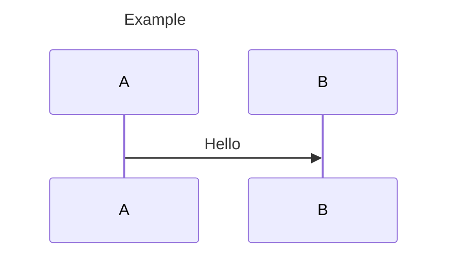
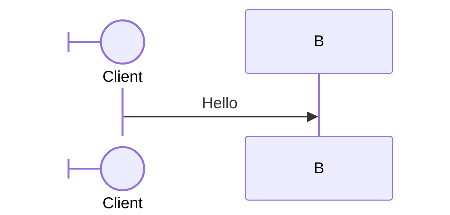
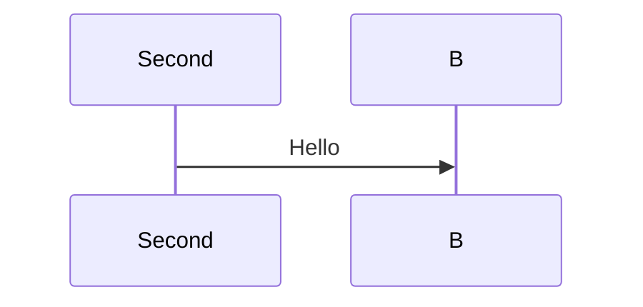
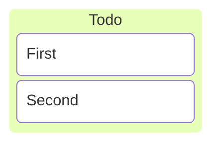

# Existing-family goal: evidence audit

2026-09-28. Read-only behavioral audit of the Trace revision recorded below. The implementation goal remains blocked; this report proposes a completion contract, not a scope change or permission to resume. Process: [goal reassessment](../../GOAL-REASSESSMENT.md).

## Reference and audit boundary

- **Trace revision:** `767376302e8038914672b39597ac1b0915bb946b`.
- **Product reference:** installed Mermaid **12.0.0**; local Mermaid source/registry revision `f9387456a1e27315e325ada0d8a1cc583ecdf95b`. The six-family interpretation is flowchart (including ELK), sequence, Gantt, journey, Kanban and state. The [37-entry release gate](spec.md) remains separate and unchanged.
- **Native reference:** Merman `72c024776a4bf2dfb9a769b67910736229355906` plus [native-provenance.patch](../../../mermaid-trace-rs/patches/native-provenance.patch), SHA-256 `c3050927499f6dcd6d7eeed2f0440a5ed456487beb7f021da53b32146b258501`. The local vendor symlink resolves to development revision `92faa8be485f5860b08b8981fecbfaed8639e719`; its complete binary diff from the base matches that patch byte for byte, and the checkout is clean.
- **Version mismatch:** Merman's fidelity baseline is Mermaid **11.17.2**, locked to `dcb694ddb58dc5ad3502e7e903cac05fd812eac3`. That baseline source checkout is not available locally. Its fixture corpus is valuable evidence, but cannot establish complete Mermaid 12 compatibility. No downgrade of the product requirement is assumed.
- **Execution boundary:** native Rust process hosted by Node 24.19.0; static SVG plus separate TypeScript activation. Existing 50,000-UTF-16-unit input cap and Merman CLI resource limits apply. Browser probes used Playwright 1.63.0 / Chromium 153.0.8010.12 on macOS arm64 with Noto Sans 5.3.0, not Firefox, Safari or manual acceptance.

One bounded pass inspected the six Mermaid grammar files and corresponding native grammar/parser and renderer/configuration paths, the Mermaid configuration schema, Trace projection, family tests and existing specs. Checks comprised the current full project suite, a native batch over the sequence/Kanban fixtures, and six targeted native-versus-Mermaid-12 render probes. This is a construct-level inventory; a complete option-by-option compatibility crosswalk is still missing. No production code or acceptance tests were changed.

## Coverage and gaps

**Verified** means the named bounded check passed at the revisions above. It does not mean the entire family is complete. **Unverified** means missing evidence, not a demonstrated failure.

| Requirement / construct and variants | Status | Evidence or concrete missing check | Responsible layer / cause |
| --- | --- | --- | --- |
| Flowchart: mapped wrappers and unchanged static rendering across 1,158 pinned fixtures | verified | Native `flow_ac5_full_pinned_inventory_maps_semantic_wrappers_and_preserves_svg` passed; [tests](../../../mermaid-trace-rs/tests/flowchart.rs) | Native provenance and SVG projection |
| Flowchart: 146 shape names, 195 connector forms, label forms, both layouts, three looks and HTML modes | verified | Existing native inventory and saved/live variant tests pass; this covers their declared combinations, not all configurations | Parser, renderer, activation |
| Flowchart: remaining configuration and grammar interactions | unverified | Finish [FLOW-2](../flowchart-mapping/spec.md#flow-2-complete-flowchart-family-coverage)'s crosswalk: spacing/padding/wrapping, curves, direction inheritance, styles/shape data, root/theme precedence and boundary values; distinguish covered cases from remaining combinations | Coverage inventory; no new defect demonstrated here |
| Sequence: basic participants, messages, notes, activation and named control blocks; note-reference ownership | verified | Four [native tests](../../../mermaid-trace-rs/tests/sequence.rs) and two [saved/live tests](../../../mermaid-trace-ts/test/sequence-activation.test.ts) pass | Native mapping and activation |
| Sequence: visible title | confirmed broken | S1 below: SVG contains `Example`, but portable mapping has no title | Native action-to-provenance capture omits the title |
| Sequence: configured participant alias | confirmed broken | S2: visible `Client` label maps to source `A` | Native label capture does not retain the configuration alias value span |
| Sequence: repeated participant declarations | confirmed broken | S3: first declaration is absent from native occurrence metadata and portable map | Native capture overwrites the previous actor occurrence |
| Sequence: all 322 pinned fixtures | unverified | 321 return artifacts; one is rejected by both native and Mermaid 12. Accepted artifacts have valid UTF-16 bounds, but exact owners/labels and static parity were not established by this batch | Missing family-wide mapping assertions |
| Sequence: lifecycle, all arrow forms, autonumber, links/properties/details, wrapping and menus | unverified | Grammar contains create/destroy, half/central/bidirectional arrows, control branches and participant configuration. Need exact-span and saved/live checks for each alternative and its effects; four native tests do not prove this coverage | Native provenance, renderer bindings and acceptance |
| Sequence: spacing, dimensions, fonts/alignment, mirrored/hidden participants, numbering, look and viewport configuration | unverified | Need option-by-option classification and boundary checks against the pinned schema/renderer; current generic configuration provenance is insufficient | Configuration semantics and visual ownership |
| Gantt: 157 pinned fixtures, tasks/milestones, fields/date dependencies, repeated IDs, sections/titles, directives and clicks | verified | Existing corpus and focused [planning tests](../../../mermaid-trace-rs/tests/planning.rs) pass, including mapped/plain parity and saved/live cases | Native mapping and renderer |
| Gantt: complete date/configuration combinations | unverified | Reconcile date/duration/exclusion/weekend/calendar alternatives, compact/top-axis behavior and every rendering option with existing checks. Current font, tick, root and degenerate-geometry tests cover specific boundaries, not the full space | Inventory and differential evidence |
| Journey: 26 pinned fixtures, scores/actors, repeated sections, title precedence, palettes, fonts and geometry boundaries | verified | Nineteen [native tests](../../../mermaid-trace-rs/tests/journey.rs) and declared saved/live cases pass | Native mapping, safe export and activation |
| Journey: complete pinned syntax/configuration contract | unverified | Crosswalk all schema options to implemented effects or proven upstream no-ops; verify remaining interactions and Mermaid 12 differences | Evidence gap; no new failure found |
| Kanban: distinct columns/cards, labels, ticket/assigned/priority fields | verified | Existing native and saved/live PLAN-AC2/3 cases pass | Native mapping and activation |
| Kanban: repeated authored IDs | confirmed broken | K1: valid input is rejected. Seven of 87 pinned fixtures fail with the same projection error | Native keys conflate occurrence identity with authored ID; shared projection rejects multiple labels |
| Kanban: full 87-fixture inventory, unlabeled/generated IDs, shape/Markdown labels, metadata overrides, icons/classes and malformed-input recovery | unverified | 80 return artifacts with valid UTF-16 bounds. Need independent owner/label expectations, mapped/plain parity and browser acceptance; basic PLAN-AC2/3 is not this gate | Native capture/binding and missing coverage |
| Kanban: section width, padding, ticket URL, font/look and viewport precedence | unverified | Need effect/no-op classification, URL safety and boundary checks, including native `mindmap`/`kanban` precedence | Renderer/configuration and host activation |
| State: 286 pinned fixtures and 48 header/direction/look/HTML variants; notes, regions, transitions and repeated-description ownership | verified | Eighteen [native tests](../../../mermaid-trace-rs/tests/structural.rs), STATE-2 and declared saved/live checks pass | Existing state gate remains valid |
| State: Mermaid 12 differences and complete configuration crosswalk | unverified | STATE-2's pinned inventory is not evidence for every newer syntax/configuration combination. Check schema options and renderer aliases against the product reference | Version/coverage evidence; no new state defect found |
| Shared source ownership and equal-span grouping | verified | Existing state-note/region, flowchart, journey and sequence-note saved/live checks pass; [contract](../source-ownership/spec.md) unchanged | Shared activation works for the checked mappings |
| Every native occurrence either binds a visual or has an explicit nonvisual/generated disposition | unverified | Batch flagged unbound occurrences in 62 sequence and eight successful Kanban fixtures. Activation-end/control markers and column-only metadata can be legitimately nonvisual; classify them before declaring bugs | Native classification/projection; counts are triage, not defect counts |
| Configuration provenance for all six families, saved artifact validation, instance isolation and CLI watch/source pane | verified | Current [source-provenance](../../../mermaid-trace-ts/test/source-provenance.test.ts), [activation](../../../mermaid-trace-ts/test/svg-activation.test.ts) and [CLI](../../../mermaid-trace-ts/test/watch-cli.test.ts) suites pass within their assertions | Shared metadata/Markdown/activation |
| Retired-demo migration acceptance on current route | unverified | Real rendered-text drag/formatted ranges, scripts-disabled rendering and denied-clipboard behavior need current native-preview acceptance; see [activation verification](../svg-activation/spec.md) | Missing host/browser evidence; do not silently retire behavior |
| Full six-family compatibility with Mermaid 12 and broader browser support | unverified | No complete 11.17.2→12 grammar/configuration diff or cross-browser acceptance was run | Reference and environment boundary |

## Confirmed defect reproducers

Feed these sources to the existing native JSON-lines executable as `{"id":"audit","source":"…"}`. Compare reference rendering through `renderReferences` in [mermaid-browser.ts](../../../mermaid-trace-ts/src/producer/mermaid-browser.ts). All four inputs render in the installed Mermaid 12 reference harness. These are distinct demonstrated failures; no claim is made that one fix closes them all.

**S1 — title has no source-backed target:** expected title mapping for the displayed `Example`.

**S2 — configuration alias has the wrong label range:** both renderers display `Client`; native actor `A` has `labelSpan` `[28,29)`, selecting `A`. Expected the authored `Client` value, with the rest of the declaration owned by the participant.

**S3 — earlier declaration is erased:** both renderers display `Second`, correctly. Native `sequence/parse.rs::build_sequence_db` replaces the previous `actor:A` occurrence. Expected both declarations retained, with explicit effective/superseded ownership; the first must not invent a displayed `First` label or disappear from provenance.

**K1 — repeated ID breaks artifact production:** reference displays two cards; native returns `Unsupported source map: multiple explicit labels for one node`. Expected separate card occurrences, visual identities and source ranges. Do not fix this by accepting two distinct cards as one selection target.

The native parser constructs keys from `node.id` in `kanban.rs`; Trace's shared `annotate` guard then encounters multiple labels for that key. The pinned fixture `upstream_cypress_kanban_spec_1_should_render_a_kanban_with_a_single_section_001.mmd` reproduces the same failure. Six other upstream-derived fixtures trigger that guard; they are not six additional proven root causes.

Two negative findings prevent false bug counts: `sequence/stress_end_keyword_016.mmd` is rejected by both renderers at the `(end)` message target; the Kanban YAML-title probe displays no `Board` title in either renderer, so absence of a visible title binding is not itself a defect.

## Proposed finite completion contract

Subject to user agreement before implementation resumes:

1. Keep the **same six families**, all their pinned Mermaid 12 syntax and applicable configuration/renderer variants, including flowchart ELK. Merman 11.17.2 remains a differential aid, not a reduced compatibility target. Later upstream releases do not expand this goal automatically.
2. Close the four confirmed defects and resolve each unverified row into executable acceptance or source-backed proof of a nonvisual/generated/no-op case. Enumerate grammar alternatives and schema options; exercise boundary classes and interactions that share renderer paths. A fixture count or smoke pass cannot substitute for this crosswalk.
3. Preserve all existing acceptance. Each distinct source-backed visual has exact original UTF-16 ownership; references do not hijack declarations; multiple occurrences survive; equal-span visuals form one logical selection/focus group. Verify source→visual and visual→source, labels, unlabeled connectors, background selection and copied Markdown locations.
4. Verify mapped/plain rendering parity, inert saved SVG activation without the producer, nested/repeated Markdown instances, optional native source selection, CLI reload/error recovery and the outstanding migration checks. Retain the existing safe-export/resource constraints. Newly discovered bugs inside this behavior stay in scope.
5. Keep other families, WASM, packaging/VS Code and the all-family release outside this goal; they remain separate requirements. Resolve the browser acceptance boundary and the required level of visual fidelity to Mermaid 12 explicitly before calling the goal complete. Current evidence is Chromium-only, and native mapped/plain equality does not prove upstream pixel equality.

## Measurements and next decision

`make test typecheck` passed with Node 24.19.0: **107 Rust tests, 98 TypeScript/browser tests, zero failures, and typechecking**. The TypeScript/browser test runner reported **786.3 seconds (13.1 minutes)** for this run. These are existing assertions; the four new reproducers are audit findings, not yet regression tests.

The additional native corpus probe processed 409 fixtures in **9.19 seconds** with a persistent process. It found seven Kanban mapping rejections and one sequence input rejected by both renderers. This measures a render/projection probe, not development throughput or equivalent coverage to the browser suite. Six targeted native/reference probes established the four defects and two negative findings above. Documentation link checks and `git diff --check` passed.

There is still **no defensible remaining-hours forecast**. The audit separates four confirmed defects from missing evidence, but has measured no representative fixes. After agreement on the contract, first close K1 and the sequence provenance failures with TDD, record investigation/implementation/verification time separately, then reassess comparable remaining work. Reuse corpus gates for broad artifact checks and targeted browser cases for distinct interaction behavior; do not multiply every fixture by every browser gesture without a coverage reason.

The audit stops here. No implementation goal was resumed, no requirement was weakened, and no new family was added.

## Implementation checkpoints

2026-09-28, following the user's instruction to proceed: **K1 resolved** under [KANBAN-2-OCCURRENCES](../planning-diagrams/spec.md#kanban-2-occurrences-implemented). The historical table above records the audit baseline. All 87 Kanban fixtures now render with static parity; repeated-card and metadata saved/live selection passes. S1–S3 and the other unverified acceptance areas remain open. Browser/fidelity choices remain unresolved; this common-behavior fix does not decide them or close the six-family goal.

First timed sample: 20:11:40–20:20:38 UTC, approximately **nine AI agent wall-clock minutes** from source investigation to verified K1 checks, excluding final documentation/commit delivery. Native corpus verification took 3.15 seconds; the two focused browser tests took 4.78 seconds in the final run. This includes test development/corrections and overlapping verification; it is not nine minutes of production editing and cannot be extrapolated across unlike gaps.
